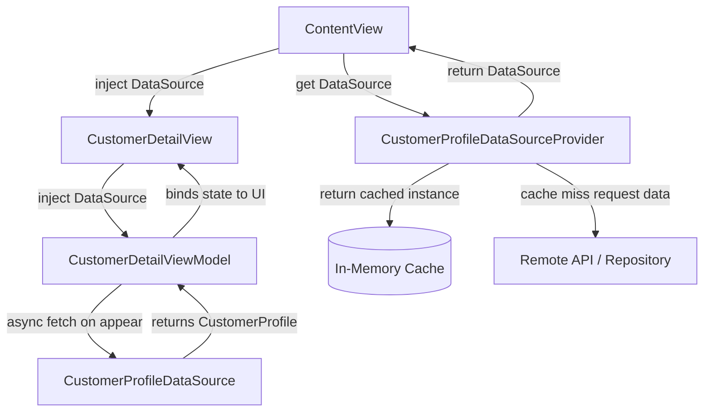

# Sample Swift UI Project

This project shows a simple setup for a vanilla SwiftUI project. 

## Goal
I'm practicing for interviews and want to explore different ways to handle dependency injection within SwiftUI. I have several patterns I've tried out with different variations involving ViewModels and Environment objects, but curious as to what else is out there.

I'd like to get some feedback on dependency injection for this project. I've had reasonable success for this, but am open trying out some other ideas.

## Design
The overall design takes advantage of a standard MVVM architecture utilizing `DataSources` as a means for "source of truth" and `DataSourceProviders` as a simple in memory caching mechanism. 




- `ContentView` is the entry point and routes to `CustomerDetailView`.
- The datasource provider uses in-memory cache first, then fetches from the API/repository on cache miss.
- The datasource provider builds a data source.
- The datasource is passed down from `ContentView` into `CustomerDetailView`.
- `CustomerDetailViewModel` asks the datasource to fetch/load customer data.

## Alternative 1
I've looked into injecting data sources via `@Environment`, however, these are not available in the view's initializer. This results in an optional ViewModel, or a View model that has optional data sources. 

```swift
struct MyView {
  @State private var viewModel = ViewModel(dataSource: nil)

  @Environment(\.dataSource) private var dataSource: DataSource

  init() {
    // dataSource isn't available here.
  }

  var body: some View { ... }

  final class ViewModel {
    // PROBLEM! I'd like to avoid an optional data source if we can. We know it's coming, it's just not available yet.
    let dataSource: DataSource?

    init(dataSource: DataSource?) {
      self.dataSource = dataSource
    }
  }
}
```


## Alternative 2 
(I'm kind of liking this as I write it out)

Similar to 1, except the ViewModel itself is provided via `@Environment` by the parent. 

```swift
struct ParentView {
  let dataSource: DataSource

  var body: some View {
    ChildView
      .environment(ChildView.ViewModel(dataSource)) // ViewModel type is not constrained. 
  }
}

struct ChildView {
  @Environment(ViewModel.self) private var viewModel: ViewModel

  final class ViewModel {
    let dataSource: DataSource

    init(dataSource: DataSource) {
      self.dataSource = dataSource
    }
}
```

My issue with this is that the parent is responsible for building the view model. Not a major problem, but View model is an internal aspect to the View and really nobody else should know about it. Also, the parent needs to know the *correct* view model. Again, not a huge issue with the name spacing, but there is nothing really preventing us from passing `SomeOtherView.ViewModel` through the environment. 

I think we could solve this though with some creative View Modifiers. I haven't built it out, but I'm thinking we could define a `protocol ViewWithModel: View`. Then we can use associatedType to link a View with it's ViewModel type. Then we can build a view modifier that only accepts the correct ViewModel type for view it's attached to.

```swift
// Not tested or compiled, just brainstorming.
struct ParentView: View {
  let dataSource: DataSource

  var body: some View {
    ChildView()
      .viewModel(.init(dataSource: DataSource)) // This modifier only takes in a ChildView.ViewModel.
  }
}
```

## Closing thoughts
I really feel that a ViewModel is necessary. It acts as the glue between our data models and the View, and helps us properly separate responsibilities so that our views are not performing any business logic. I'm going to try building out alternative 2 and see how it goes.  